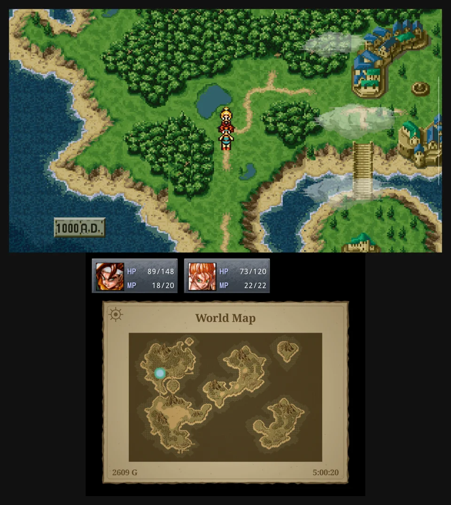
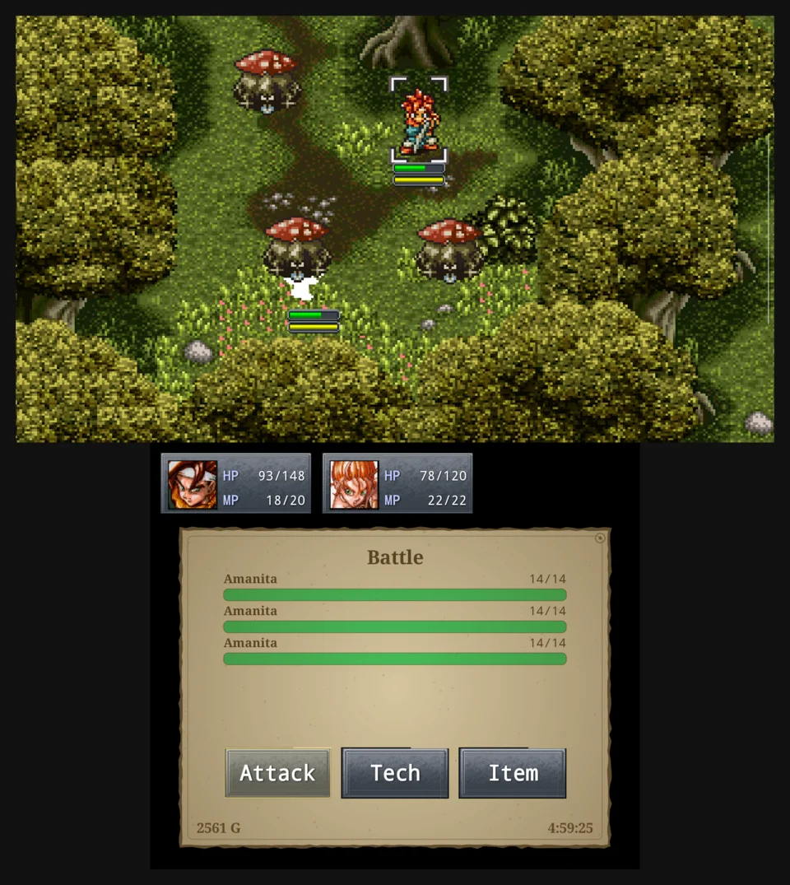
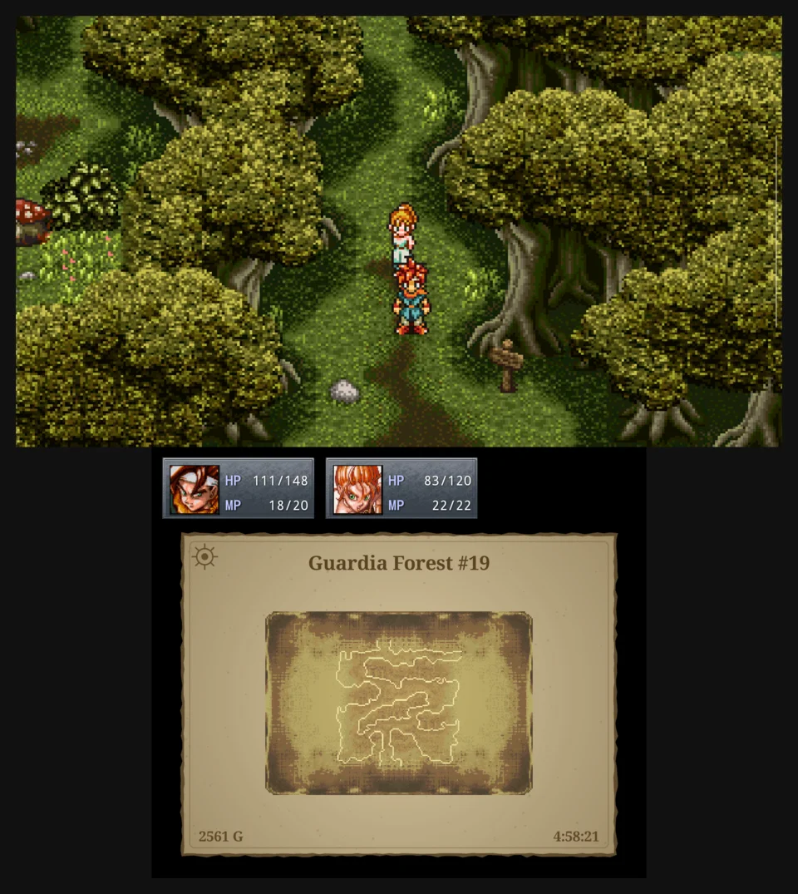

# ChronoDuo

[](https://github.com/kalenjohnson/chrono-duo/actions/workflows/build.yml)
[](https://github.com/kalenjohnson/chrono-duo/releases)
[](LICENSE)

A dual-screen host for **Chrono Trigger (Upgrade Ver.)** on dual-screen Android
handhelds such as the Ayn Thor. The real game runs full-widescreen on the top
screen while the bottom screen becomes a DS-style companion display: a live
world map, party status, and the whole battle command menu. On top of that
ChronoDuo adds the things the mobile port never had: a mod manager, SNES and
DS save import, fast-forward, true widescreen, and original pixel art.

ChronoDuo ships **no game code or assets**. It loads the official Chrono
Trigger Android app you already own, inside its own process, and drives the
second screen through Android's standard `Presentation` API.

<p align="center">
  
</p>

## Requirements

- A dual-screen Android device (developed on the Ayn Thor Lite). Any device
  that exposes a second display to `Presentation` should work.
- Android 8.0+ with an arm64 CPU.
- The official [CHRONO TRIGGER (Upgrade Ver.)](https://play.google.com/store/apps/details?id=com.square_enix.android_googleplay.chrono)
  from Google Play, version 2.1.5 or newer, installed on the same device.
- Optional: your own Chrono Trigger DS ROM (`.nds` or `.zip`) to enable indoor
  area maps. Nothing from the ROM is shipped or uploaded; it is decoded on
  your device.

## Install

1. Install Chrono Trigger from Google Play and launch it once.
2. Download `ChronoDuo-<version>.apk` from the
   [Releases page](https://github.com/kalenjohnson/chrono-duo/releases) and
   install it (allow installs from unknown sources, or `adb install`).
3. Launch **ChronoDuo** instead of Chrono Trigger. The game boots on the top
   screen and the companion display appears on the bottom.

ChronoDuo keeps its own saves, separate from the Google Play game's. Update
by installing over the old APK; uninstalling removes settings, mods, and
saves.

## What the bottom screen does

- **Overworld map** in a sepia, torn-parchment style with a live position
  marker, the current location name, gold, and play time. All eight era maps
  are rendered on first launch from the game's own map data, and story
  changes such as bridges and craters show up as they happen.
- **Party status** with real portraits in the game's own window chrome and
  live HP and MP.
- **Battle mirroring**: the Attack/Tech/Item menu and the Tech and Item
  lists move to the bottom screen, driven by the d-pad, so the top screen
  stays HUD-free. An **AUTO** chip toggles the game's Auto Battle mode.
  Enemy HP bars honor the game's hidden-info design by default, with an eye
  toggle to reveal them.
- **Indoor area maps** with a live marker once you import your DS ROM, with
  a DS-style **fog of war** that reveals dungeon rooms as you explore them.

<p align="center">
  
  
</p>

## Game features

- **True widescreen**: the mobile port crops 64 rows off the SNES frame.
  This shows the full 224 rows plus the extra width of a 16:9 screen.
- **Fast-forward**: hold or toggle R2 to run the game at 2x, 3x, or 5x.
- **Original pixel art**: rebuilds the unfiltered SNES-style sprites, field
  chips, and overworld tiles from the 1x art the game itself ships, with
  nearest-neighbour filtering.
- **Save import**: load a SNES (`.srm`), DS (`.sav`, `.dst`, `.duc`,
  `.dsv`) or Steam/PC (`save_NN.bin`) save into a save slot.

## Mods

ChronoDuo has a built-in mod manager. Mods are applied as a file overlay on
top of the game's own assets; the Google Play install is never modified.

- **Curated catalog** under Settings > Mods: Pixel Demaster, SNES Overworld
  Sprites Restoration, SNES Wood Menu, Orchestral Wonders, FMV's Remastered,
  and more. Tap **Get** to open the mod's Nexus Mods page on the bottom
  screen and download it straight into ChronoDuo.
- **Import anything else** from a file, or open a `.ctp` with ChronoDuo.
  Loose files, `.ctp`, `.zip`, `.7z`, and RAR4 are supported.
- **Multi-part mods** such as Pixel Demaster show up as one row with option
  pickers for each of their choices.
- **Whole-archive mods** such as full music repacks install as an overlay of
  just the changed files.
- **Cutscene and font mods** work: replacement FMVs and custom in-game fonts.
- Mods live under `Android/data/com.kalenjohnson.chronoduo/files/mods/` and
  can be dropped there by hand. **Order matters**: the Mods tab has ▲/▼
  buttons to set each mod's priority, and if two mods change the same file
  the one higher in that order wins. The order is stored in
  `mods/.order`; a mod not yet listed there falls back to alphabetical.

### Settings

Tap the gear in the top-left corner of the bottom screen (outside battle),
or use the d-pad. Tabs: Imports (DS ROM, saves), Graphics (pixel art,
widescreen), Maps (fog of war), Speed, and Mods.

## Build from source

You need an Android SDK with NDK and CMake 3.22+, and a JDK 17 through 21.

```
./gradlew assembleDebug
adb install app/build/outputs/apk/debug/app-debug.apk
```

`gradle.properties` pins `org.gradle.java.home` to a local JDK 21 path.
Adjust it, or override on the command line:

```
./gradlew -Dorg.gradle.java.home=/path/to/jdk21 assembleDebug
```

### Releases

GitHub Actions builds every push. Pushes to `main` refresh the rolling
**Latest build** pre-release; a `v*` tag creates a versioned release whose
notes come from `docs/releases/v<version>.md`. See `NOTES.md` for signing
setup.

## How it works

At startup ChronoDuo locates the game install, extracts its `libchrono.so`
and `libc++_shared.so` into private storage, points the engine's asset
loading at the game's own APK, and boots the engine inside ChronoDuo's
process. A small native helper reads the live game state and hooks the
engine for widescreen, fast-forward, mods, and HUD hiding; the Java side
draws the companion screen.

`NOTES.md` is the full research and design record. The `tools/` directory
holds the verification scripts and their reports.

## License

ChronoDuo is released under the [MIT License](LICENSE).
`THIRD_PARTY_NOTICES.md` covers bundled third-party code: the vendored
`org.cocos2dx.lib` Java classes from cocos2d-x 3.14.1 (MIT) and the
libraries pulled in for networking and mod archive extraction.

Chrono Trigger is the property of Square Enix. No Square Enix assets or code
are included. The app loads the official Android game you have installed,
the optional indoor maps are decoded on your device from your own DS ROM,
and mods are files you download or add yourself.
